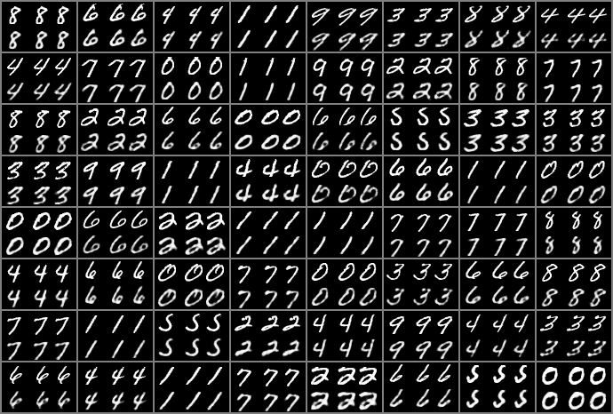
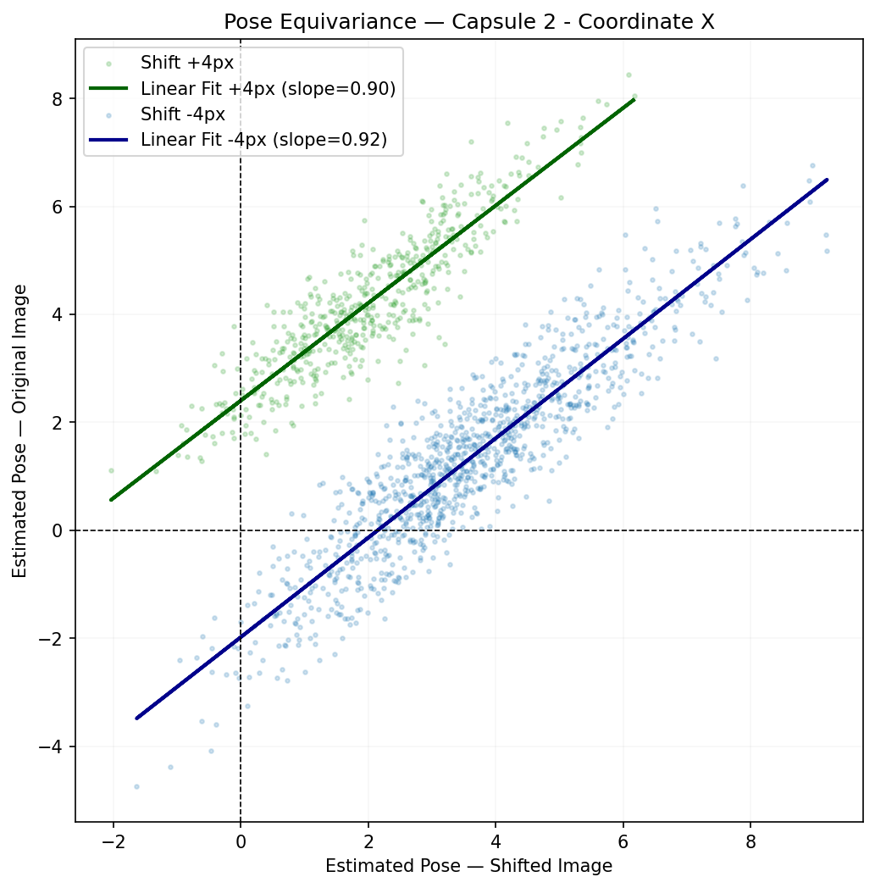
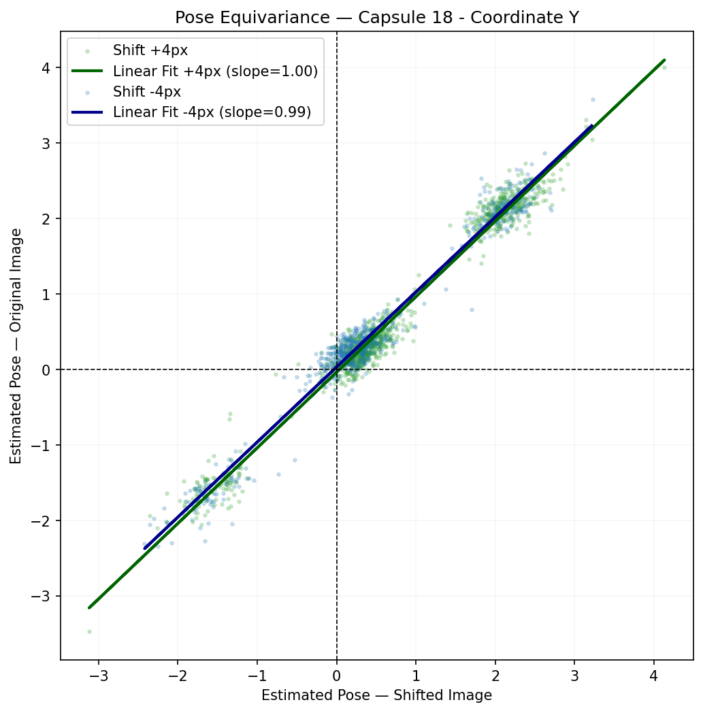
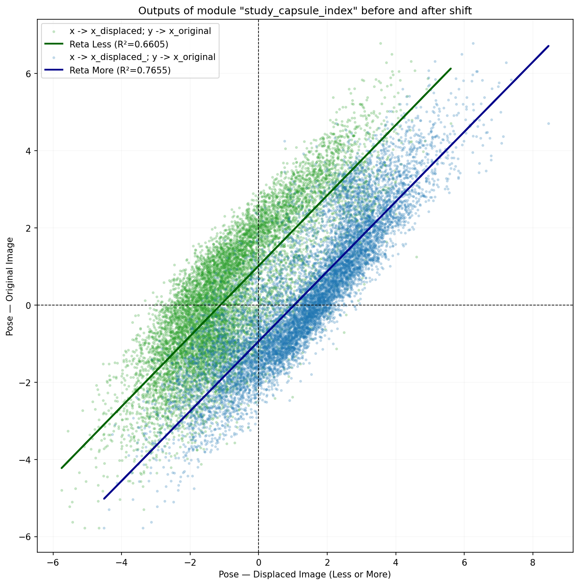

# Transforming-Autoencoders-Pytorch-2011

This project is based on the research presented in the following paper:

    [Hinton, Geoffrey E., Alex Krizhevsky, and Sida D. Wang. "Transforming auto-encoders." International Conference on Artificial Neural Networks. Springer, Berlin, Heidelberg, 2011.](http://www.cs.toronto.edu/~fritz/absps/transauto6.pdf)

Adicionar uma breve introdução ao paper, mostrar brevemente os resultados, e etc...
Falar que foi executado num macbook M1 RAM 16 GB
Fazemos dois estudos um para reconstução das imagens e outro para equivarience 

## Requirements

Ao final correr este script pip freeze > requirements.txt e fazer os requirements 
o utilizador so precisa de correr o seguinte codigo pip install -r requirements.txt para instalar as bibliotecas e versoes corretas

## Scripts and Folders: 
    Fazer tabela:
    main.py -> Model training
    capLayer.py -> Capsule layer
    capsule.py -> Individual capsule
    aux_functions.py -> auxiliary functions
    gradients_aux.py -> gradient functions  
    test.py -> Model testing
    poses.py -> To trace the relationship between poses in the displaced images and the original images.

## Usage

*Note: Running on the CPU is sometimes faster than MPS due to the data transfer overhead between memories on lightweight models.*

### main.py 

### Poses & Equivariance Evaluation (`poses.py`)
> ⚠️ **Prerequisite:** Before running this script, you must train the model using `main.py`.

The hyperparameters passed in the command line **must match exactly** those used during the model's training phase (e.g., `--batch_size`, `--len_pose`, etc.). Otherwise, the model weights will fail to load correctly due to architecture mismatches.

    $ python3 poses.py --device cpu --dataset MNIST --batch_size 64 --lr 0.001 --cap_gen 40 --cap_rec 40 --num_caps 25 --len_pose 2 --size_displacement 4

[See Results](#poses--equivariance-evaluation-posespy-1).

    

### The Default Hyper Parameters:
| CLI Arguments | Value | Help |
| --- | --- | --- | 
| --device | mps | Device to use for training (e.g., "cpu", "cuda", "mps"); Never tested for cuda |
| --batch_size | 64 | Batch size for training |
| --epochs | 40 | Number of epochs to train |
| --num_caps | 25 | Number of capsules |
| --cap_rec | 40 | Capsule reconstruction dimension |
| --cap_gen | 40 | Capsule generation dimension |
| --lr | 0.001 | Learning rate |
| --dataset | MNIST | Dataset for training or test, only accepts "MNIST", "FashionMNIST", "CIFAR10" or "Mine". The "Mine" mode is specifically used in `test_no_displacement.py` to evaluate the CIFAR-10 trained model on custom personal images. To use this feature, you must create a folder named "Mine_Dataset", where the model exists(exe: Results/CIFAR10/64_75_40_40_0.001_16/Test) and place your custom images inside it. |
| --len_pose | 2 | Capsule pose vector length. Use 2 for strict spatial equivariance analysis, or > 2 to image reconstruction. |
| --size_displacement | 4 | To control the size of the displacement, if want to train just for reconstruction set this to 0 |

## Results 

### Poses & Equivariance Evaluation (`poses.py`)
Initially, the model was trained with displacements within the following range: (-4,4) pixels. In this test, all images were displaced exactly -4 or 4 pixels.

The test image grid is organized in blocks of 6 images. For each block:
* **Top Row:** Target images — Original, Shifted (-4 pixels), and Shifted (+4 pixels).
* **Bottom Row:** Model Reconstructions — Reconstruction of the original, Reconstruction of the -4 shift, and Reconstruction of the +4 shift.

Even though the pixel-level reconstruction of the digits is not completely flawless, the spatial translation is evident and highly accurate! This proves the model successfully learned a linear latent space for the pose: when we manually add a displacement vector ($dx$) to the latent capsule coordinates extracted from the original image, the decoder is able to precisely reconstruct the shifted object at the exact target position.

Other analysis was the relationship between the pose estimates of the original and shifted images. Two complementary analyses were performed:
1 — X Coordinate: the X pose of the shifted image is compared against the X pose of the original image.
2 — Y Coordinate: the Y pose of the shifted image is compared against the Y pose of the original image, where the shift was applied exclusively to the X axis.
A probability threshold of ≥ 0.80 was applied to filter out low-confidence capsule activations — only poses where the capsule assigned a high probability of feature presence were retained. This ensures that the analysis reflects meaningful capsule behaviour rather than noise.
1 - X Coordinate — Pose Equivariance

Parallelism — parallel fit lines indicate that the capsule responds symmetrically and consistently to both directions of displacement. A rightward shift produces the same magnitude of pose change as a leftward shift.
Slope — the slope of the fit line quantifies how much the original pose changes per unit change in the shifted pose. A slope of 1.0 indicates perfect equivariance — the capsule tracks the displacement exactly. Slopes below 1.0 indicate partial equivariance, where the capsule underestimates the displacement.
Capsule 2 achieves slopes of 0.90 and 0.92 for +4px and -4px shifts respectively — near-perfect equivariance with strong symmetry between directions.

Y Coordinate — Spatial Independence

When a horizontal shift is applied to the image, the Y coordinate of the capsule pose should remain unchanged if the two spatial dimensions are truly independent.
Capsule 18 achieves slopes of 1.00 and 0.99 — confirming that the Y pose estimate is completely invariant to horizontal displacement. The two fit lines are nearly identical and the points concentrate tightly along the diagonal, demonstrating that the capsule learned a spatially disentangled representation where X and Y pose coordinates are orthogonal and independent.

### Folder Structure Results
All results are saved dynamically in the folder 'Results' with the folliwing structure:

* Results/{dataset}/{batch_size}_{num_caps}_{cap_rec}_{cap_gen}_{learning_rate}_{len_pose}_{size_displacement}

Inside this folder we save: 

* Test
    * In_Out_Target_Images
    * Mine_Dataset
    * Results_Mine_Test
* Train
    * Generative_Plot
    * In_Out_Target_Images
    * Loss_Image_TXT
    * Mean_Gradients_by_Capsule
    * Mean_Gradients_by_Layer
* Poses
    * Comparison_Original_Shift
    * Images
* best_model.pth

### Interpretabilidade

## Some Annotation About The Code

## Model Design
Para reconstrução e para equivarience

## To Do

- [x] Added command-line arguments for all hyper parameters;
- [x] Added comments across all scripts to help understand the code;
- [x] Multi-Dataset Support: The code has been adapted to handle different datasets, MNIST, FashionMNIST and CIFAR10;
- [x] Capsule Activation Functions: Integrated non-linear activation functions within the capsules to improve feature representation and gradient flow.
- [x] Added different cost functions for different databases. CIFAR -> MSELoss, Rest -> BCEWithLogitsLoss 
- [x] Results are dynamically saved in a hierarchical folder structure based on the hyperparameters. [See More](#folder-structure-results).
- [x] POSES.
- []  Analyze what each cluster represents in the following image. [Análise de Equivariância da Cápsula 18](Results/MNIST/64_25_40_40_0.001_2_4/Test/Equivariance/Capsule_Pose_Analysis/Y/Pose_Equivariance_Cap18.png)  

 

## Credits

The codebase was originally forked from [IsCoelacanth](https://github.com/IsCoelacanth/TransformingAutoencoder_PyTorch)

## Key Modifications: 

*   Results are dynamically saved in a hierarchical folder structure based on the hyperparameters: Results/{dataset}/{batch_size}_{num_caps}_{cap_rec}_{cap_gen}_{learning_rate}/. Example: Results/fashion-mnist/6_25_16_16_0.001/. Inside each folder we store: 'Image_Loss' -> A plot representing the Loss Function evolution for each epoch.
*   Function that save the Input/Target/Output Images for comparison
* **Gradient Analysis Plots:**
  * `Gradients_Per_Capsule`: Visualizes the mean gradient behavior for each individual capsule across epochs or batch_size.
  * `Gradients_Per_Layer`: Displays the gradient flow across different layers across epoch or batch_size.
* **Latent Space & Spatial Equivariance Diagnostics (`poses.py`):** Developed a dedicated evaluation framework to validate the network's mathematical behavior against Geoffrey Hinton's core formulation of capsule-based coordinate frames.
    * **Methodology:** Tracks and extracts the learned internal capsule pose parameters before and after applying physical horizontal shifts generated dynamically via PyTorch `affine_grid` and `grid_sample` mapping.
    * **Linear Equivariance Validation:** Outputs comprehensive scatter plots with linear regression lines, proving a high correlation between original and displaced latent representations, backed by robust Coefficients of Determination.
    * **Directional Awareness:** Visualizes a distinct, parallel geometric separation between the **Less (-3)** and **More (+3)** translation trends, confirming that the targeted capsule successfully internalizes both the magnitude and direction of the displacement vector ($dxy$).
    * **Feature Disentanglement:** Demonstrates that the architecture successfully extracts a continuous coordinate system for spatial reasoning instead of merely memorizing surface-level pixel intensities.
    * Within the Poses/Comparison_Original_Shift folder, we can see some results filtered by the probability of the capsule(threshold >= 0.9), removing some noise.
    * Below is the generated scatter plot proving the linear relationship of the latent space (): 
* **Dual-Mode Training Strategy: Equivariance vs. Reconstruction Capacity**: The architecture is highly flexible and dynamically adapts its training behavior based on the `--len_pose` hyperparameter:
    * **Equivariance Mode (`--len_pose 2`):** Restricts the latent space strictly to $X$ and $Y$ coordinates to enforce and analyze geometric translation equivariance.
    * **Generative Reconstruction Mode (`--len_pose > 2`):** Bypasses the spatial displacement constraint to maximize the model's capacity for complex image synthesis. Used for training with the cifar10 dataset. 
* **Evaluation**: To support the dual-mode architecture strategy, the framework includes two dedicated testing scripts, one for image reconstruction "MINE" other for equivariance.

