# Transforming-Autoencoders-Pytorch-2011

This project is based on the research presented in the following paper:

    [Hinton, Geoffrey E., Alex Krizhevsky, and Sida D. Wang. "Transforming auto-encoders." International Conference on Artificial Neural Networks. Springer, Berlin, Heidelberg, 2011.](http://www.cs.toronto.edu/~fritz/absps/transauto6.pdf)

Adicionar uma breve introdução ao paper, mostrar brevemente os resultados, e etc...
Falar que foi executado num macbook M1 RAM 16 GB
Fazemos dois estudos um para reconstução das imagens e outro para equivarience 

## Requirements

Ao final correr este script pip freeze > requirements.txt e fazer os requirements 
o utilizador so precisa de correr o seguinte codigo pip install -r requirements.txt para instalar as bibliotecas e versoes corretas

## Scripts and Folders: 

| Scripts | Explanation |
| --- | --- | 
| main.py | Training script — saves results including loss curves, generative weight visualisations, batch reconstructions, gradients flow by capsule and layer during all training phase | 
| capLayer.py | Defines the CapLayer module — a collection of 'NUM_CAPS' independent capsules processed in parallel. | 
| capsule.py | Defines the Capsule module — the core building block of the architecture. Each capsule contains five linear layers: a recogniser (inp_rec), a pose estimator (rec_xy), a presence probability estimator (rec_prob), a generator (xy_gen), and a reconstructor (gen_out). The forward pass encodes the input into a pose, applies the spatial displacement, and decodes back into image space. | 
| aux_functions.py | Auxiliary functions used across scripts | 
| gradients_aux.py | Auxiliary functions for gradient monitoring during training — accumulates the mean absolute gradient per layer across all batches, and generates two types of gradient flow plots: one organised by individual capsule (showing all five layers per capsule) and one organised by layer type (showing the mean gradient across all capsules), both using a logarithmic scale to reveal vanishing gradient behaviour. | 
| poses.py | Test-time analysis script — loads a pretrained model and evaluates pose equivariance by comparing pose estimates of original and horizontally shifted images across all capsules. Generates scatter plots with linear fits for both X and Y coordinates also creates a comparison between original images vs. output images model. | 
| aux_function_poses.py | Auxiliary functions used in the poses.py scripts | 
| test.py | Test-time script that evaluates the model with or without applying any spatial displacement, supporting custom datasets | 
| Custom_Data_Set.py | Defines a custom PyTorch Dataset class to load and preprocess non-standard datasets — allows the architecture to be evaluated on data beyond the built-in torchvision datasets such as MNIST and CIFAR10. | 

All results are saved dynamically in the folder 'Results' with the folliwing structure:

* Results/{dataset}/{batch_size}_{num_caps}_{cap_rec}_{cap_gen}_{learning_rate}_{len_pose}_{size_displacement}

Inside this folder we save: 

* Test 
    * Mine_Dataset: Custom Data Set 
    * In_Out_Target_Images_With_Displacement_{size_displacement}: Images generated during test-time evaluation with a displacement in the range [-SIZE_DISPLACEMENT, SIZE_DISPLACEMENT] pixels applied to the input. Each image triplet shows the original input, the ground truth shifted target, and the capsule reconstruction side by side.
    * In_Out_Target_Images_Without_Displacement: Images generated during test-time evaluation with zero displacement (dxy=0). Each image pair shows the original input and the capsule reconstruction, allowing assessment of pure reconstruction quality independently of the equivariance mechanism.
    * Results_Mine_Test_With_Displacement_{size_displacement}: Images generated during test-time evaluation on the custom dataset with a displacement in the range [-SIZE_DISPLACEMENT, SIZE_DISPLACEMENT] pixels applied to the input. Each image triplet shows the original input, the ground truth shifted target, and the capsule reconstruction side by side. Allows qualitative assessment of how well the model generalises the learned equivariance to out-of-distribution data.
    * Results_Mine_Test_Without_Displacement: Images generated during test-time evaluation on the custom dataset with zero displacement. Allows qualitative assessment of pure reconstruction quality on out-of-distribution data.
    * Equivariance 
        * Images_Reconstruction: Images saved at randomly selected batches during test-time evaluation. Each image is organized in blocks of 6 images, Top row (Ground Truth): original, shifted - {SIZE_DISPLACEMENT} pixels and shifted + {SIZE_DISPLACEMENT} pixels. Bottom Row (Model Reconstructions): reconstruction of the original, reconstruction of the - {SIZE_DISPLACEMENT} pixels, and Reconstruction of the + {SIZE_DISPLACEMENT} pixels.
        * Capsule_Pose_Analysis
            * X: Analysis of the X coordinate — compares the X pose estimate of the horizontally shifted image against the X pose estimate of the original image.
            * Y: Analysis of the Y coordinate — compares the Y pose estimate of the horizontally shifted image against the Y pose estimate of the original image.         
* Train
    * Generative_Plot: For each epoch, saves one image displaying the generative weights (gen_out.weight) of all capsules. Each image is organised as a grid where each row corresponds to a capsule and each column corresponds to one generative unit — allowing visual inspection of the patterns learned by each capsule over the course of training.
    * In_Out_Target_Images: For each epoch, saves one image from the second-to-last batch showing three columns side by side: the original input, the shifted target, and the capsule reconstruction. Allows qualitative monitoring of reconstruction quality throughout training.
    * Loss_Image_TXT: For each epoch, saves a plot of the training loss (Y axis — Loss, X axis — iterations) including a moving average line to highlight the overall trend. Additionally saves a .txt file logging the epoch number, epoch duration in seconds, and loss value for every epoch of the full training run.
    * Mean_Gradients_by_Capsule: For each epoch, saves one image displaying the mean absolute gradient per layer for each individual capsule across all batches. Each subplot corresponds to one capsule and shows five lines — one per layer (inp_rec, rec_xy, rec_prob, xy_gen, gen_out) — plotted against the number of iterations. Useful for detecting vanishing gradients or dead capsules at the individual level.
    * Mean_Gradients_by_Layer: For each epoch, saves one image displaying the mean absolute gradient aggregated across all capsules, plotted per layer type against the number of iterations. Provides a global view of gradient health across the entire architecture — five lines, one per layer type.
* best_model.pth: The model checkpoint saved during training corresponding to the lowest loss value observed across all epochs and batches. Used as the starting point for all test-time evaluations.

## Usage

*Note: Running on the CPU is sometimes faster than MPS due to the data transfer overhead between memories on lightweight models.*

*Note: The command shown below is the exact one used to generate the results demonstrated below. Feel free to train and test the model with different hyperparameters!*

*Note: The hyperparameters passed in the command line **must match exactly** those used during the model's training phase (e.g., `--batch_size`, `--len_pose`, etc.). Otherwise, the model weights will fail to load correctly due to architecture mismatches, and the path used to load the model (`best_model.pth`) will fail.*

### Training Pipeline — Loss, Capsules Gradients, Layers Gradients, Generative Weights, and Image reconstruction (`main.py`)

    $ python3 main.py --device cpu --dataset MNIST --batch_size 64 --lr 0.001 --cap_gen 40 --cap_rec 40 --num_caps 25 --len_pose 2 --size_displacement 4
    
    $ python3 main.py --device cpu --dataset CIFAR10 --batch_size 64 --lr 0.001 --cap_gen 40 --cap_rec 40 --num_caps 75 --len_pose 16 --size_displacement 0

[See Results](#)Link

### Poses & Equivariance Evaluation (`poses.py`)
> ⚠️ **Prerequisite:** Before running this script, you must train the model using `main.py`.

    $ python3 poses.py --device cpu --dataset MNIST --batch_size 64 --lr 0.001 --cap_gen 40 --cap_rec 40 --num_caps 25 --len_pose 2 --size_displacement 4

[See Results](#poses--equivariance-evaluation-posespy-1).

### Evaluation Of The Model Reconstruction (`test.py`)
> ⚠️ **Prerequisite:** Before running this script, you must train the model using `main.py`.

    $ python3 test.py --device cpu --dataset CIFAR10 --batch_size 64 --lr 0.001 --cap_gen 40 --cap_rec 40 --num_caps 75 --len_pose 16 --size_displacement 0 --custom_dataset

[See Results](#evaluation-of-the-model-reconstruction-testpy-1). Adicionar link

    

### The Default Hyper Parameters:
| CLI Arguments | Value | Help |
| --- | --- | --- | 
| --device | mps | Device to use for training (e.g., "cpu", "cuda", "mps"); Never tested for cuda |
| --batch_size | 64 | Batch size for training |
| --epochs | 40 | Number of epochs to train |
| --num_caps | 25 | Number of capsules |
| --cap_rec | 40 | Capsule reconstruction dimension |
| --cap_gen | 40 | Capsule generation dimension |
| --lr | 0.001 | Learning rate |
| --dataset | MNIST | Dataset for training or test, only accepts "MNIST", "FashionMNIST", "CIFAR10" or "Mine". The "Mine" mode is specifically used in `test.py` to evaluate the CIFAR-10 trained model on custom personal images. To use this feature, you must create a folder named "Mine_Dataset", where the model exists(exe: Results/CIFAR10/64_75_40_40_0.001_16/Test) and place your custom images inside it. |
| --len_pose | 2 | Capsule pose vector length.|
| --size_displacement | 4 | To control the size of the displacement, if want to train just for reconstruction set this to 0 |
| --custom_dataset | action='store_true' | Specifically for test.py script. To use this feature, you must create a folder named "Mine_Dataset" inside the folder "Test" and place your custom dataset inside it. |

## Results 

### Training Pipeline — Loss, Capsules Gradients, Layers Gradients, Generative Weights, and Image reconstruction (`main.py`)

#### MNIST

##### Generative Weights

The following images display the patterns learned by the generative layer `gen_out` of each capsule. Each row corresponds to an individual capsule and each column corresponds to one generative unit within that capsule — representing the visual pattern that unit has learned to contribute to the final reconstruction. Each image is the visualisation of a single column of the `gen_out` weight matrix, reshaped to the original image dimensions. These patterns can be interpreted as the visual primitives that the capsule combines linearly to reconstruct the input image. Notably, recognisable digit-like structures can be identified within individual generative units.

> **Analysis tip:** this plot should be interpreted alongside the Generative Weights visualisation.

Epoch01
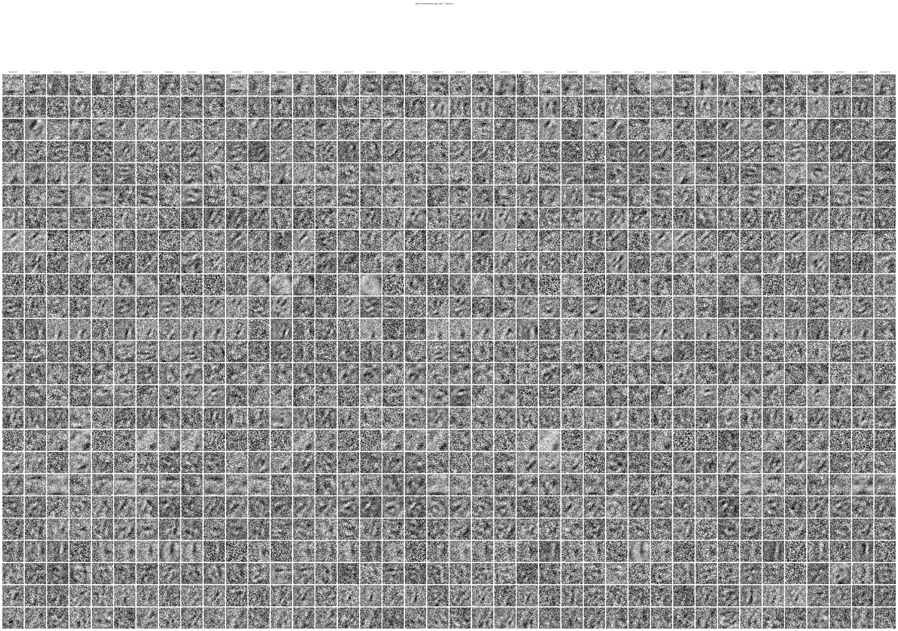

Epoch22
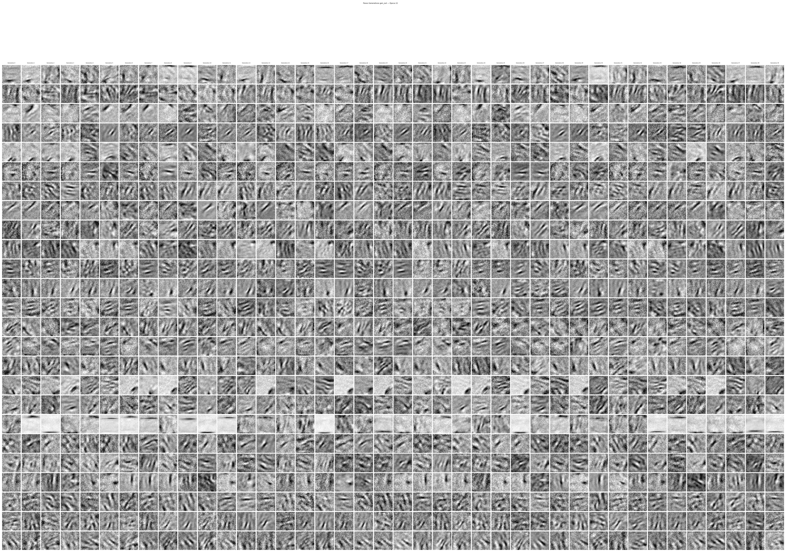

Epoch40
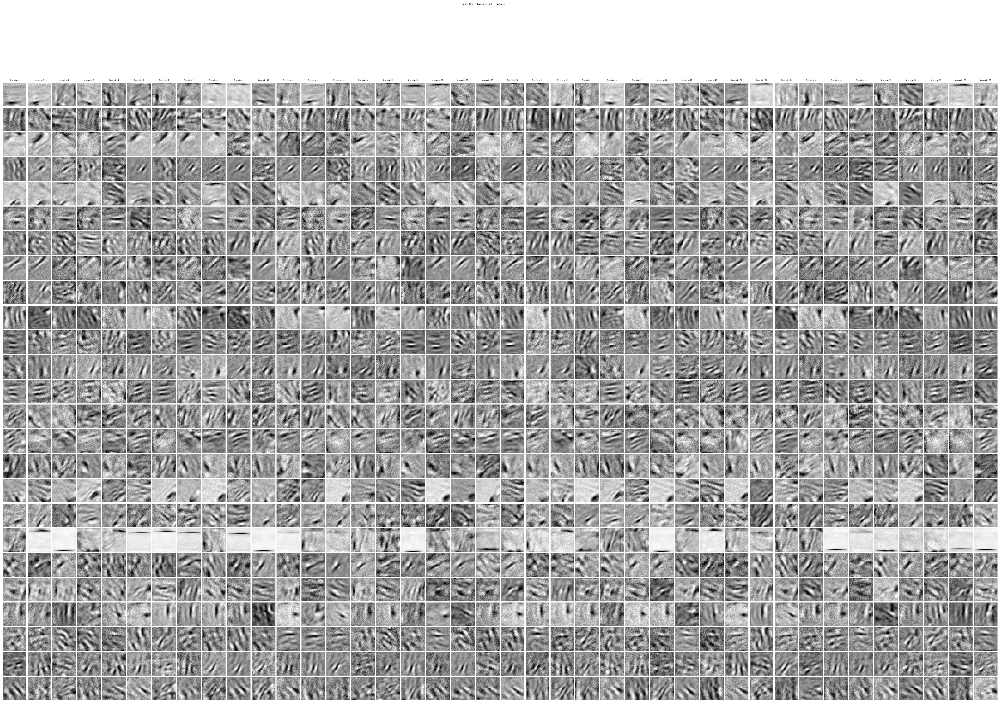

#### Image reconstruction

The following images display the reconstruction results of the model. Each image triplet is organised as follows: the original input image, shifted target image (shift range [−4, +4] pixels), and the corresponding model output reconstruction (input of the model = (original_image, shift range [−4, +4] pixels)).

Epoch01
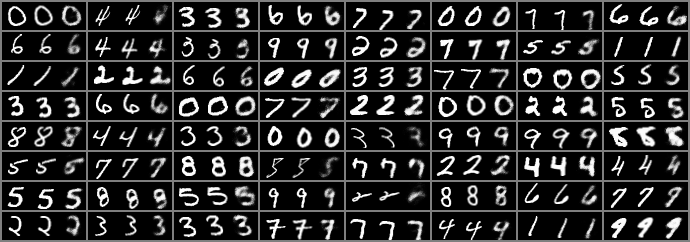

Epoch23
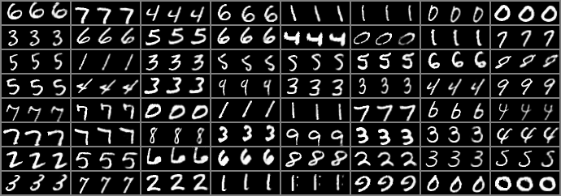

Epoch40
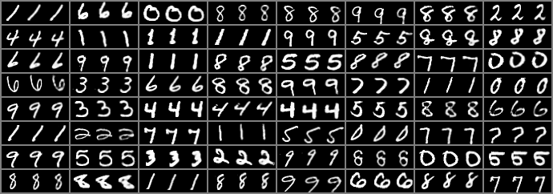

#### Loss

The following plot shows the progression of the training loss over all iterations.

Epoch01
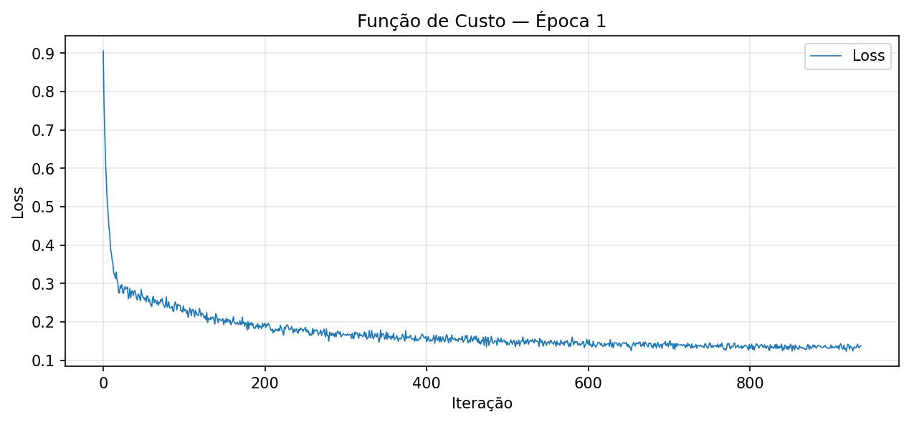

Epoch40
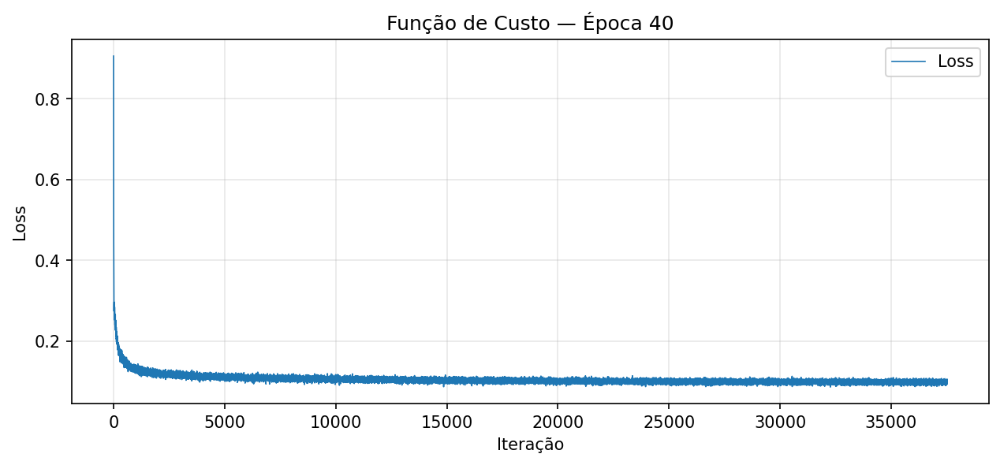

#### Capsules Gradients

The following image shows the mean absolute gradient of each layer within each individual capsule across all batches. Additional more plots are available inside the `Results` folder.

Each subplot corresponds to one capsule and displays five lines, one per layer (`inp_rec`, `rec_xy`, `rec_prob`, `xy_gen`, `gen_out`), plotted on a logarithmic scale. 

> **Analysis tip:** this plot should be interpreted alongside the Generative Weights visualisation.

Epoch40
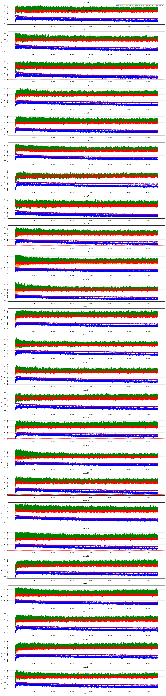

### Layers Gradients
The following image shows the mean absolute gradient aggregated across all capsules, displayed per layer type. This provides a global view of gradient health across the entire architecture.

Epoch01
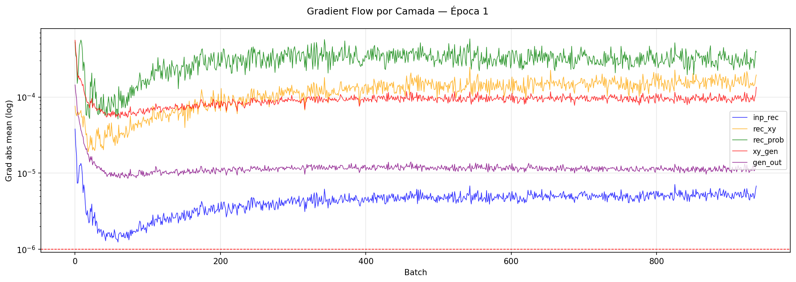

Epoch40
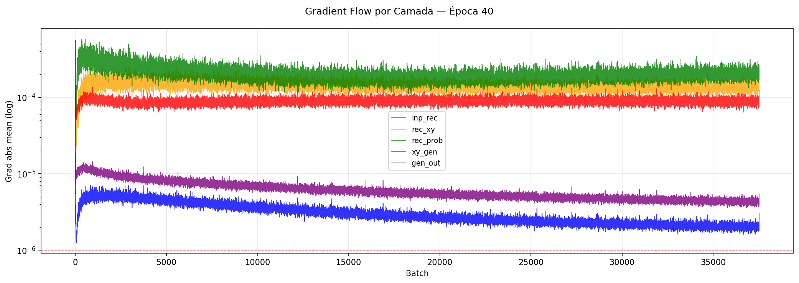

#### CIFAR10

##### Generative Weights

The following images display the patterns learned by the generative layer `gen_out` of each capsule. Each row corresponds to an individual capsule and each column corresponds to one generative unit within that capsule — representing the visual pattern that unit has learned to contribute to the final reconstruction. Each image is the visualisation of a single column of the `gen_out` weight matrix, reshaped to the original image dimensions. These patterns can be interpreted as the visual primitives that the capsule combines linearly to reconstruct the input image.

> **Analysis tip:** this plot should be interpreted alongside the Generative Weights visualisation.

Epoch001

Epoch150

#### Image reconstruction

The following images display the reconstruction results of the model. Each image triplet is organised as follows: the original input image, shifted target image, and the corresponding model output reconstruction. No Displacement was apply, so original input image = shifted target image.

Epoch001
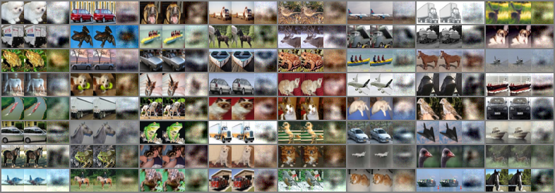

Epoch124
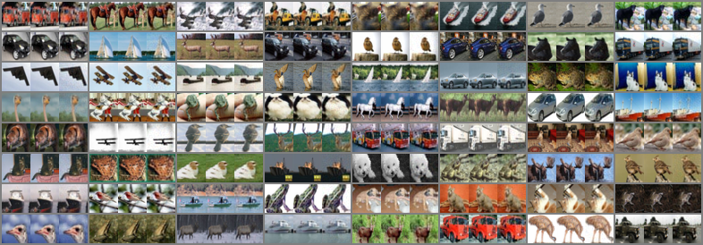

Epoch150
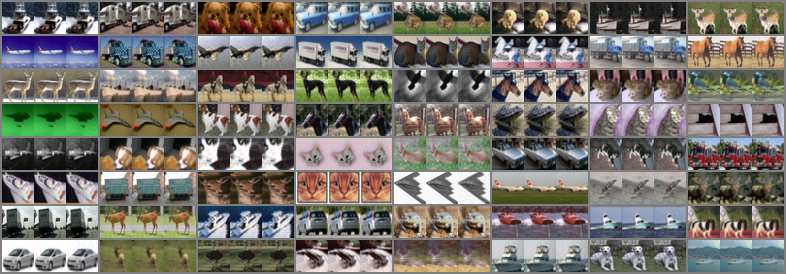

#### Loss

The following plot shows the progression of the training loss over all iterations.

Epoch001
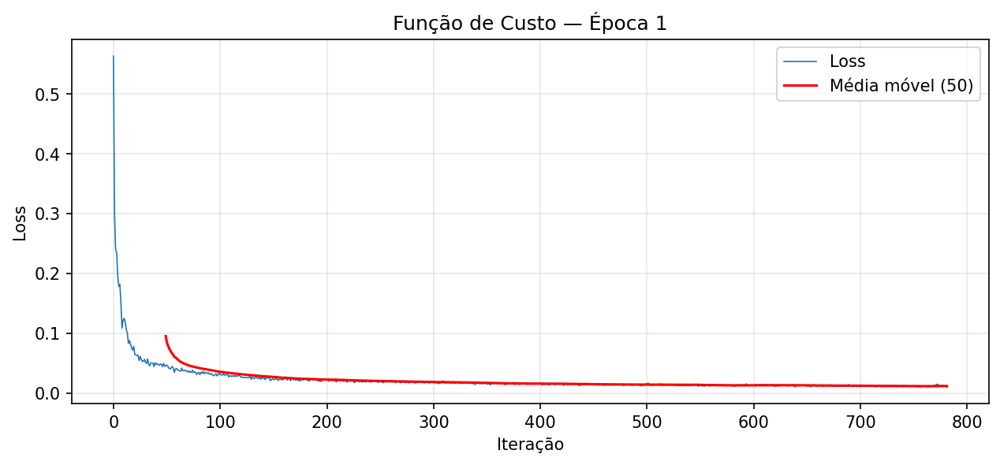

Epoch150
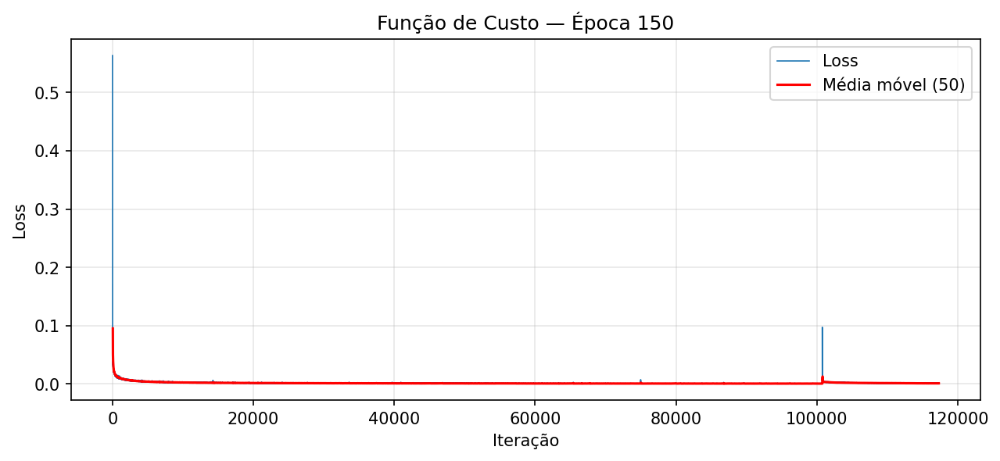

#### Capsules Gradients

The following image shows the mean absolute gradient of each layer within each individual capsule across all batches. Additional more plots are available inside the `Results` folder.

Each subplot corresponds to one capsule and displays five lines, one per layer (`inp_rec`, `rec_xy`, `rec_prob`, `xy_gen`, `gen_out`), plotted on a logarithmic scale. 

> **Analysis tip:** this plot should be interpreted alongside the Generative Weights visualisation.

Epoch150

### Layers Gradients

The following image shows the mean absolute gradient aggregated across all capsules, displayed per layer type. This provides a global view of gradient health across the entire architecture.

Epoch001
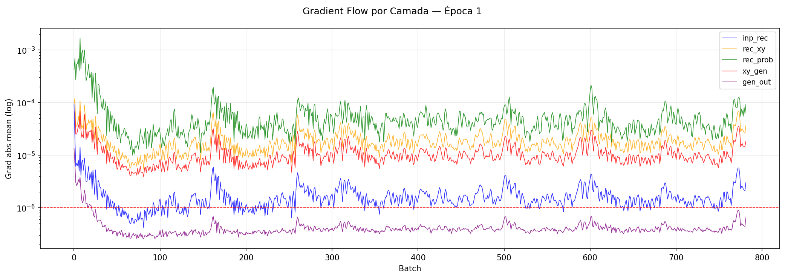

Epoch150
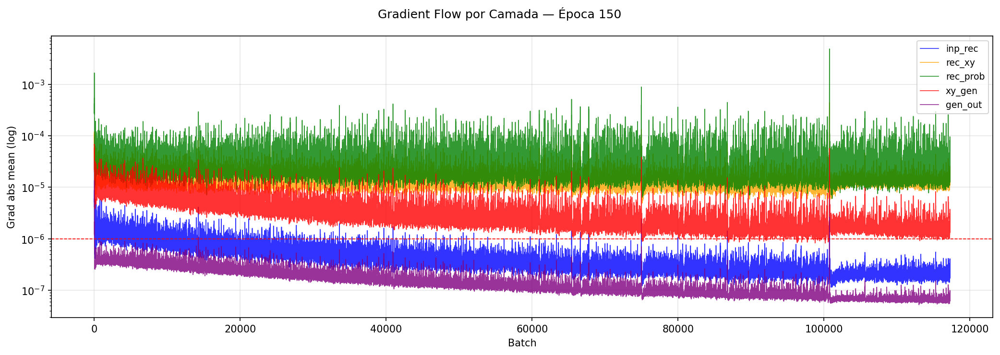

### Poses & Equivariance Evaluation (`poses.py`)
Initially, the model was trained with displacements within the following range: (-4,4) pixels. In this test, all images were displaced exactly -4 or 4 pixels.

The test image grid is organized in blocks of 6 images. For each block:
* **Top Row:** Target images — Original, Shifted (-4 pixels), and Shifted (+4 pixels).
* **Bottom Row:** Model Reconstructions — Reconstruction of the original, Reconstruction of the -4 shift, and Reconstruction of the +4 shift.

Even though the pixel-level reconstruction of the digits is not completely flawless, the spatial translation is evident and highly accurate! This proves the model successfully learned a linear latent space for the pose: when we manually add a displacement vector ($dx$) to the latent capsule coordinates extracted from the original image, the decoder is able to precisely reconstruct the shifted object at the exact target position.

################################

Other analysis was the relationship between the pose estimates of the original and shifted images. Two complementary analyses were performed:

1 — X Coordinate: the X pose of the shifted image is compared against the X pose of the original image.

2 — Y Coordinate: the Y pose of the shifted image is compared against the Y pose of the original image, where the shift was applied exclusively to the X axis.

A probability threshold of ≥ 0.80 was applied to filter out low-confidence capsule activations — only poses where the capsule assigned a high probability of feature presence were retained. This ensures that the analysis reflects meaningful capsule behaviour rather than noise.

1 - X Coordinate — Pose Equivariance

Parallelism — parallel fit lines indicate that the capsule responds symmetrically and consistently to both directions of displacement. A rightward shift produces the same magnitude of pose change as a leftward shift.

Slope — the slope of the fit line quantifies how much the original pose changes per unit change in the shifted pose. A slope of 1.0 indicates perfect equivariance — the capsule tracks the displacement exactly. Slopes below 1.0 indicate partial equivariance, where the capsule underestimates the displacement.

Capsule 2 achieves slopes of 0.90 and 0.92 for +4px and -4px shifts respectively — near-perfect equivariance with strong symmetry between directions.

2 - Y Coordinate — Spatial Independence

When a horizontal shift is applied to the image, the Y coordinate of the capsule pose should remain unchanged if the two spatial dimensions are truly independent.

Capsule 18 achieves slopes of 1.00 and 0.99 — confirming that the Y pose estimate is completely invariant to horizontal displacement. The two fit lines are nearly identical and the points concentrate tightly along the diagonal, demonstrating that the capsule learned a spatially disentangled representation where X and Y pose coordinates are orthogonal and independent.

### Evaluation Of The Model Reconstruction (`test.py`)

The model was evaluated on two distinct test sets to assess reconstruction quality and generalisation capability beyond the training distribution.

Both evaluations were performed without displacement (dxy = 0), isolating the model's ability to encode and reconstruct images independently of the equivariance mechanism.

In the two examples, the left side shows the original image, and the right side shows the reconstructed image.

#### CIFAR10 Test Dataset
Reconstruction results on the official CIFAR10 test set (10,000 images). The model produces recognisable reconstructions across all 10 classes — vehicles, animals, and objects — preserving the dominant colours and overall structure of each image. 

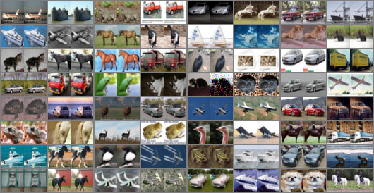

#### Custom Test Dataset
Reconstruction results on a custom dataset composed of images captured on a mobile phone — entirely out-of-distribution relative to the CIFAR10 training data. Despite never having seen this type of imagery during training, the model produces coherent reconstructions that preserve the general structure and colour palette of the input images. This demonstrates that the learned capsule representations generalise beyond the training distribution.

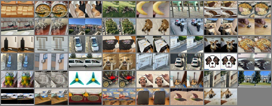

## To Do

- [x] Added command-line arguments for all hyper parameters;
- [x] Added comments across all scripts to help understand the code;
- [x] Multi-Dataset Support: The code has been adapted to handle different datasets, MNIST, FashionMNIST and CIFAR10;
- [x] Capsule Activation Functions: Integrated non-linear activation functions within the capsules to improve feature representation and gradient flow.
- [x] Added different cost functions for different databases. CIFAR -> MSELoss, Rest -> BCEWithLogitsLoss 
- [x] Results are dynamically saved in a hierarchical folder structure based on the hyperparameters. [See More](#scripts-and-folders).
- [x] Compare the original image with model reconstruction and displacement image with model displacement image.
- [x] Pose Equivariance — X Coordinate: compare shifted vs original X pose estimates across all capsules; measure slope and parallelism of linear fits.
- [x] Spatial Independence — Y Coordinate: verify that horizontal shifts do not affect the Y pose estimate, confirming orthogonality of the learned spatial dimensions.
- [x] The test.py script accepts a custom dataset.
- [ ] Analyze what each cluster represents in the following image. [Análise de Equivariância da Cápsula 18](Results/MNIST/64_25_40_40_0.001_2_4/Test/Equivariance/Capsule_Pose_Analysis/Y/Pose_Equivariance_Cap18.png)  
- [ ] Try to find patterns in the relationship between the results and pain using the chosen hyperparameters.
- [ ] Analyze the results when we change the "optimizer".
- [ ] When the pose value is greater than 2, understand what each number in the pose represents (x, y, rotation, etc.). Test this in the poses.py script.
- [ ] Explorar e analisar relações entre a camada generative de cada capsulas com por exemplo Poses etc....
- [ ] The results are based on images, create some metrics.
- [ ] Adicionar um ficheiro txt, dentro diretorio onde o modelo esta guardado com a informação do modelo summary()
- [ ] Train and test for Norb dataset
- [ ] **Generalise to Real-World Domain-Specific Datasets** — adapt the training and evaluation pipeline to support real-world image datasets, with a particular focus on medical imaging (e.g. X-rays, MRI scans, histology slides). Evaluate whether the capsule architecture can learn meaningful pose representations and produce coherent reconstructions in high-stakes domains where interpretability and spatial equivariance are especially valuable. Key adaptations may include:
  - Supporting greyscale and multi-channel medical image formats
  - Handling higher resolution inputs beyond 32×32
  - Evaluating reconstruction quality using domain-appropriate metrics 
    such as SSIM and PSNR in addition to MSE
- [ ] Generalise BatchShift_torch to support arbitrary pose dimensions, currently the function only applies displacement along the X and Y axes. Extend the function to generate a displacement vector R of dimension pose_dim.
- [ ] Poses.py script on the equivarience results only produces for the X and Y axis. Adapt the code for more axis on {pose_dim}.
- [ ] Train a model with CIFAR dataset with 1 or 2 or 3 ... and analyze the Generative_Plot for each result. In the MNIST Dataset the generative wights draw numbers, look for the same in the CIFAR10
- [ ] In the generative_Plot there are interesting results, plotting these individual and augmented results to try to better understand the picture (CIFAR10).
- [ ] After analyzing the images reconstructed by generative and flow capsule gradients, we were able to identify some patterns.
- [ ] In the images resulting from the gen_out layer, we can see that there are weights that never learn! This requires changing the transformer architecture in some way to bring these weights to life.
- [ ] After analyzing the CIFAR10 training with 16 poses and 150 epochs, we can see that gradient flow still existed and some gen_outs were waking up. We should train the model with, for example, 400 epochs to see if the gradient dies, if the generatives stop learning, or if any capsule wakes up later.
- [ ] Pass a single image through the model, show a comparison between the original and the reconstruction. Show all images generated by the generative weights where the probability of that same capsule is greater than 0.7 (or another treshold).
- [ ] Analyzing the gen_out of MNIST, we can see that the resulting images from the gen_out layer are drawing whole numbers. We can easily see that a gen_out is drawing a 2 or 3, etc. A study would be conducted where I analyze the model's behavior for each individual label and verify which capsules activate and what the resulting image of the generative weights is.
- [ ] The current architecture connects `rec_prob` to the recognition layer (`cap`) and multiplies the final reconstructed image by the presence probability. Two architectural modifications are proposed and should be evaluated: 1º rec_prob connected to the generative layer gen instead of estimating the presence probability from the recognition features, estimate it from the generative representation after the spatial displacement has been applied. 2º instead of scaling the final reconstructed image by a single scalar probability, apply the probability as a gate on the generative activations before reconstruction. 

## Credits

The codebase was originally forked from [IsCoelacanth](https://github.com/IsCoelacanth/TransformingAutoencoder_PyTorch)